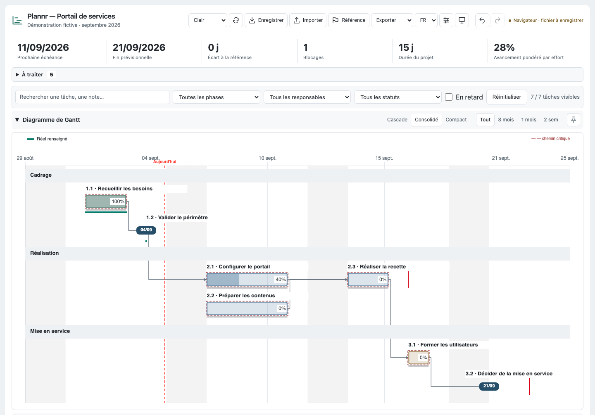
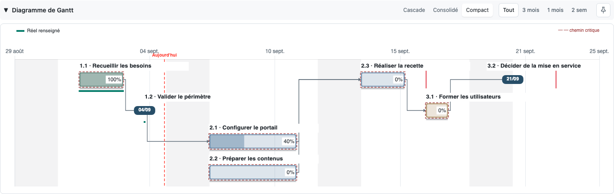
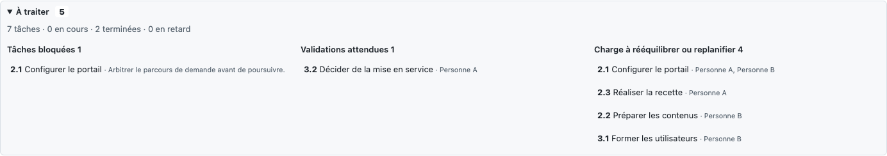
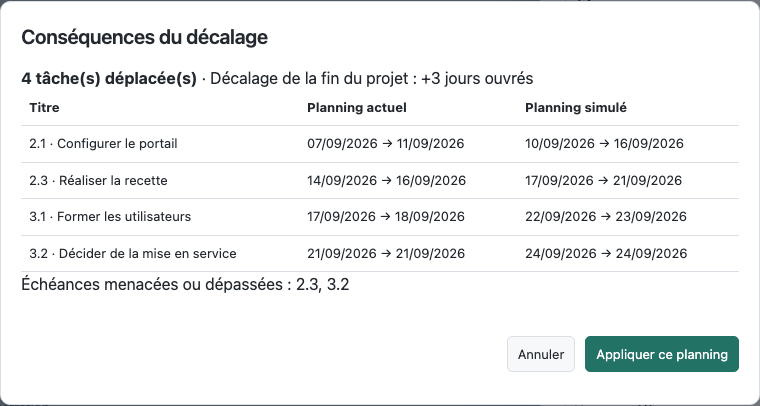
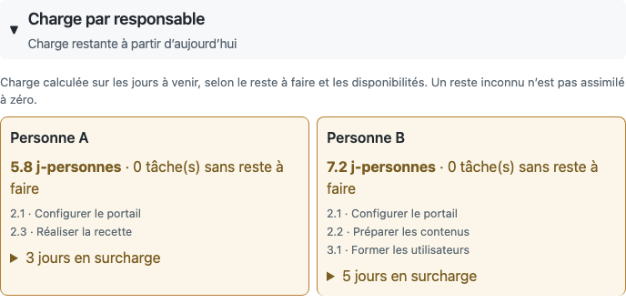
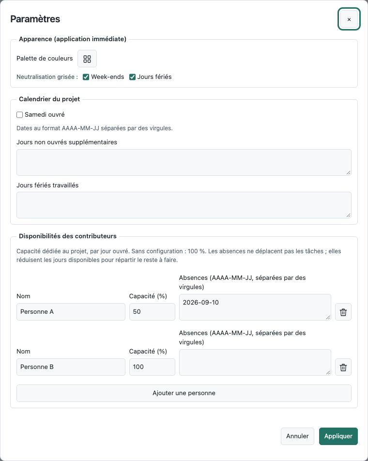
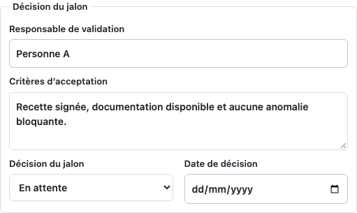

<div align="center">
  
  <h1>Plannr</h1>
  <p>Planifier, suivre le réalisé et préparer les décisions, dans un fichier HTML autonome.</p>
</div>

Plannr est une application de planning de projet utilisable directement dans le navigateur, sans installation, compte ni serveur applicatif. Elle associe un Gantt interactif, un tableau éditable, le suivi des charges et des jalons de décision. Les bibliothèques sont intégrées au HTML : aucun CDN n'est nécessaire.

<picture>
  <source media="(prefers-color-scheme: dark)" srcset="docs/screenshots/apercu-dark.png">
  
</picture>

*Toutes les captures utilisent le même [projet fictif de démonstration](docs/examples/demo-v2.4.json). [Voir le thème sombre](docs/screenshots/apercu-dark.png).*

## Démarrer

1. Télécharger [plannr.html](https://github.com/guthubrx/plannr/raw/refs/heads/main/plannr.html).
2. L'ouvrir dans un navigateur récent. Le fichier [plannr-data.js](plannr-data.js), placé à côté du HTML, permet de charger un planning au démarrage.
3. Pour découvrir le suivi métier, télécharger le [document de démonstration](docs/examples/demo-v2.4.json), puis utiliser **Importer** dans Plannr.
4. Utiliser **Enregistrer** pour conserver un fichier de données, ou **Exporter → HTML** pour transmettre une copie autonome contenant le projet.

Le thème clair ou sombre, la vue et la période sont mémorisés dans le navigateur. Chrome et Edge peuvent proposer l'écriture directe du fichier après sélection de son emplacement ; les autres navigateurs utilisent le téléchargement.

## Lire et modifier le planning

| Vue | Usage |
| --- | --- |
| **Cascade** | Une ligne par tâche, pour examiner les dates et les enchaînements. |
| **Consolidé** | Regroupement par phase et placement des tâches parallèles sur des lignes distinctes. |
| **Compact** | Regroupement temporel pour réduire la hauteur du diagramme. |

Les libellés disposent d'un espace réservé : les lignes s'adaptent aux titres longs, avec texte complet dans le tableau et le panneau **Détails**. Sur un petit écran, le calendrier et le tableau défilent dans leur propre zone ; le Gantt se réajuste lorsque la largeur disponible change.



- **Commandes dans l'en-tête** : vues, période et bouton punaise tout à droite. L'épinglage maintient le diagramme visible pendant le défilement sur ordinateur.
- **Périodes** : tout le projet, trois mois, un mois ou deux semaines ; navigation précédente/suivante et retour à aujourd'hui.
- **Recherche et filtres** : texte, phase, personne, statut et retards, synchronisés entre tableau et Gantt. Les calculs et exports restent fondés sur le document complet.
- **Édition** : titres, dates, contributeurs, statut et pourcentage directement dans le tableau ; champs complémentaires et modifications groupées dans **Détails**.
- **Organisation** : ajout, suppression et réordonnancement des phases et tâches. Les identifiants restent stables pour préserver les dépendances et la référence.
- **Interactions** : déplacement et redimensionnement des tâches dans le Gantt ; ouverture des détails par clic. Alt + glisser déplace aussi les descendants modifiables.
- **Présentation** : mode dédié pour masquer les commandes d'édition ; thèmes clair et sombre, icônes géométriques et pourcentage discret.

## Suivre l'avancement et le réalisé

Les indicateurs affichent la prochaine échéance, la fin du projet selon les dates disponibles, l'écart à la référence, les blocages, la durée et l'avancement.

- **Durée du projet** : enveloppe début-fin en jours ouvrés, sans additionner les tâches parallèles.
- **Avancement pondéré** : par effort si toutes les tâches de travail sont estimées et que le total est positif ; sinon par durée ouvrée. La méthode est affichée. Les tâches annulées sont exclues.
- **Effort et reste à faire distincts** : estimation initiale et travail restant en jours-personnes, indépendants du pourcentage. Une valeur inconnue n'est pas assimilée à zéro.
- **Prévision, référence et réalisé** : la référence fige un engagement ; les dates réelles sont renseignées explicitement et représentées sur une piste séparée. Les cascades ne déplacent pas le début d'une tâche commencée ni les dates d'une tâche close.
- **Six statuts** : À faire, En cours, Bloqué, À valider, Terminé, Annulé. Un pourcentage de 100 % ne vaut pas validation automatique de la livraison.

**À traiter** regroupe les blocages, validations, échéances menacées, informations manquantes, conflits de dépendances et problèmes de capacité. Chaque entrée ouvre la tâche concernée.



## Dépendances, contraintes et simulation

Les dépendances relient les tâches avec une contrainte de début au plus tôt : le jour ouvré suivant la fin du prédécesseur, plus un éventuel délai. Par exemple, `1.2+3` ajoute trois jours ouvrés à cette contrainte.

- Saisie dans **Détails**, sélecteur à cases à cocher dans le tableau, ou création graphique d'un lien depuis la pastille d'une barre.
- Contrôle des cycles et décalage automatique des successeurs modifiables.
- Dates butoirs, ligne du jour, détection des retards et signalement des contraintes non respectées.
- Chemin critique et marges en jours ouvrés ; les dates planifiées sont prises comme contraintes de début au plus tôt.
- **Simuler un décalage**, depuis **Détails** : aperçu des tâches affectées, nouvelles dates, impact sur la fin et butoirs menacés. Appliquer valide une opération annulable ; abandonner ne modifie rien.



La simulation est une action explicite. Les modifications ordinaires et les glisser-déposer s'appliquent directement et restent annulables. Une dépendance vers une tâche annulée est signalée pour arbitrage.

## Responsabilités, charge et disponibilités

Le **responsable de livraison** est distinct des **contributeurs**. L'effort peut être réparti explicitement entre eux, avec un total de 100 % ; à défaut, les parts sont égales.

La charge utilise uniquement le reste à faire sur les jours futurs disponibles. Elle tient compte de la capacité dédiée au projet et des absences de chaque personne. Les tâches terminées, annulées et les jalons ne génèrent pas de charge future. Les surcharges, restes inconnus et travaux sans jour disponible restent explicites.



Dans **Paramètres**, régler la capacité quotidienne, les absences, le samedi ouvré et les exceptions au calendrier. Les jours fériés français sont calculés automatiquement ; leur grisage peut être activé séparément des règles de travail. La palette de couleurs se trouve au même endroit.



La répartition est uniforme sur les jours disponibles ; Plannr signale les surcharges sans effectuer de nivellement automatique du planning.

## Jalons de décision

Un jalon comporte une date, un responsable de validation, des critères d'acceptation et une décision : en attente, approuvée ou refusée, avec date de décision facultative. Les dates réelles ne sont jamais inventées à partir du calendrier.



## Sauvegarder et partager

| Format ou action | Contenu et usage |
| --- | --- |
| **Enregistrer / plannr-data.js** | Document rechargeable à placer à côté du HTML. |
| **JSON** | Import/export du document complet : métadonnées, phases, tâches, calendrier, référence et disponibilités. |
| **HTML** | Copie autonome de l'application contenant les données du projet et les bibliothèques. |
| **PDF** | Gantt paginé en A3 paysage, tableau des tâches, informations métier et disponibilités. Le rendu reste clair, quel que soit le thème de lecture. |
| **Excel** | Une feuille par phase, champs métier et feuille des disponibilités. |
| **CSV** | Tableau des tâches et champs métier, séparé par des points-virgules. |
| **ICS** | Jalons sous forme d'événements à importer dans un calendrier. |
| **Impression** | Mise en page A3 paysage, commandes masquées et texte lisible. |

Le document canonique est en **v2.4** ; les anciennes versions et l'ancienne clé `riskGroups` restent lisibles. Le [schéma JSON](schemas/plannr-data.schema.json) décrit les champs. Certains contrôles, tels que les cycles et la somme des répartitions, sont réalisés par l'application.

### Historique et stockage local

- Sauvegarde automatique dans le navigateur, avec restauration au rechargement et séparation par document.
- **Annuler / rétablir** sur le document complet, y compris calendrier et disponibilités. Cmd/Ctrl + Z et Cmd/Ctrl + Maj + Z ; les champs conservent leur annulation native pendant la saisie.
- État de sauvegarde visible : stockage navigateur, modifications non enregistrées dans un fichier, téléchargement ou écriture confirmée.
- Validation des imports avant remplacement, refus des cycles et signalement des anomalies corrigées et des changements depuis le chargement précédent.

La sauvegarde navigateur est distincte d'un fichier enregistré. Les exports contiennent les données du projet, notamment noms, notes, liens et disponibilités : vérifier leur contenu avant de partager son propre planning. Les documents et captures fournis dans ce dépôt sont fictifs.

## Développement et vérification

Le fichier HTML est généré depuis les sources ; ne pas le modifier directement.

```bash
python3 build.py
npm ci
npx playwright install chromium
npm test
```

La suite comprend **102 tests Chromium** : calculs métier, imports, historique, simulation, interactions, exports, contraste et géométrie des trois vues aux largeurs 1440, 768 et 390 px. L'intégration continue vérifie également que la construction reproduit exactement le HTML livré.

| Source | Rôle |
| --- | --- |
| `src/body.html`, `src/styles.css` | Structure, thèmes et présentation adaptative. |
| `src/planning.js` | Calendrier, dépendances, cascade et marges. |
| `src/document.js` | Document canonique, validation, historique et persistance. |
| `src/business.js`, `src/business-ui.js` | Indicateurs, règles métier, réalisé, charge, décisions et simulation. |
| `src/workspace.js` | Filtres, panneau de tâche, thèmes et ajustement du Gantt. |
| `src/gantt.js` | Placement, rendu et interactions graphiques. |
| `src/exports.js` | HTML, PDF, Excel et CSV. |
| `src/features.js`, `src/app.js` | Référence, fonctions complémentaires, tableau, traductions et initialisation. |
| `src/libs/` | Chart.js, jsPDF, jsPDF-AutoTable et SheetJS intégrés. |

Pour régénérer les captures du README après construction du HTML :

```bash
node scripts/capture-readme.cjs
```

Le script ouvre un navigateur isolé, bloque les accès HTTP(S), fixe la date de démonstration au 5 septembre 2026 et importe uniquement l'exemple fictif du dépôt.

## Licence et contribution

Plannr est distribué sous **GNU Affero General Public License v3.0** : voir [LICENSE](LICENSE).

Pour contribuer : créer une branche, modifier les sources, reconstruire le HTML et lancer les tests avant une pull request. Les anomalies et propositions peuvent être déposées dans les [issues du projet](https://github.com/guthubrx/plannr/issues).
